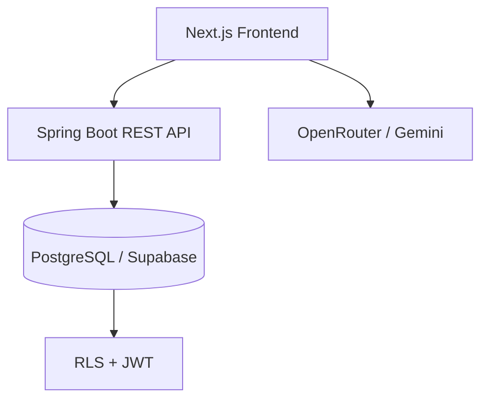
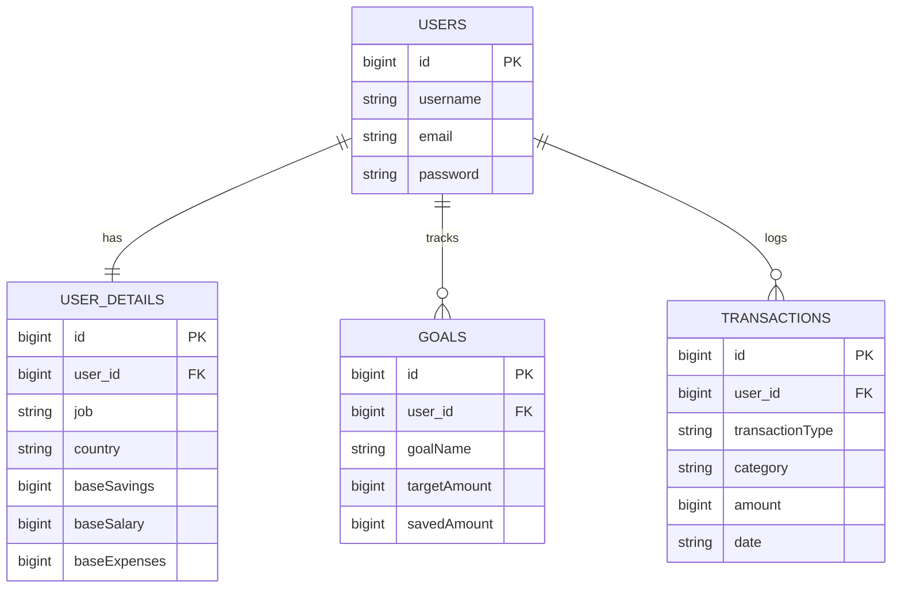

# Finora AI
### Cognitive Financial Auditing & Wealth Management Platform

<p align="center">


</p>

---

## Overview

**Finora AI** is an intelligent financial management platform designed for **individuals, entrepreneurs, and startups**.

Unlike traditional budgeting applications, Finora AI combines:

- AI-powered financial analysis
- Smart budgeting & auditing
- Credit risk simulation
- Goal-oriented savings
- Investment forecasting
- Wealth management dashboard

---

# Features

## Financial Dashboard

- Income & expense analytics
- Budget efficiency calculation
- Monthly financial overview
- Dynamic statistics
- Personal finance health score

---

## Goal Management

Create and manage financial goals.

Examples:

- Buy a Car
- Apartment
- Vacation
- New Laptop

Each goal tracks:

- Target amount
- Current savings
- Progress
- Estimated completion

---

## Investment Simulator

Interactive investment calculator with two analytical modes.

### Historical Performance

Simulates historical market movement and volatility using realistic market parameters.

### Future Growth Projection

Projects compound growth using:


| Variable | Description |
|-----------|-------------|
| **P** | Initial investment |
| **PMT** | Monthly contribution |
| **r** | Annual expected return |
| **t** | Investment duration |

Supported investment horizons:

- 1 year
- 3 years
- 5 years
- 10 years
- 20 years

---

## Loan Comparison Engine

Compare **18 loan offers** from Moldova's largest banks.

Supported banks:

- MAIB
- MICB
- OTP Bank
- Victoriabank
- FinComBank
- BCR Chișinău

Each bank includes:

- Consumer Loan
- Express Loan
- Credit Card

Real-time calculations:

- Monthly payment
- Total repayment
- Overpayment
- Interest rate
- Debt-To-Income (DTI)
- Financial risk indicator

---

## AI Financial Advisor

Generate personalized recommendations using AI.

Examples:

- Budget optimization
- Saving strategies
- Spending analysis
- Investment suggestions
- Financial planning

Powered by:

- DeepSeek Chat
- Google Gemini Flash

---

## Authentication

- JWT Authentication
- Spring Security
- Protected REST API
- Secure profile switching
- Local profile caching
- Automatic 403 handling

---

# System Architecture



---

# ⚙️ Technical Highlights

## Smart Goal Deduction

When contributing money toward a goal, users choose where funds originate.

### Savings

Updates:

```
PUT /api/users/profile
```

Reduces:

```
baseSavings
```

---

### Monthly Expenses

Creates transaction:

```
POST /api/users/details/transactions
```

Automatically recalculates:

- Expenses
- Budget efficiency
- Financial statistics

---

## Lightweight SVG Charts

Instead of using heavy charting libraries, Finora AI renders responsive SVG graphs manually.

Benefits:

- Faster loading
- Smaller bundle
- Better responsiveness
- No external plotting dependency

---

## Credit Risk Analysis

Every loan recalculates:

- Monthly annuity
- Total interest
- Total repayment
- DTI ratio

If

```
DTI > 40%
```

the interface immediately displays a financial warning.

---

## Intelligent Error Handling

The frontend intercepts authentication failures.

Instead of exposing backend errors:

```
403 Forbidden
```

Users always receive:

```
Incorrect nickname or password
```

creating a consistent authentication experience.

---

# 🗄 Database Schema



---

# Project Structure

```
finora-ai
│
├── finora-frontend
│   ├── app
│   │   ├── dashboard
│   │   ├── loans
│   │   ├── profile
│   │   │   ├── advices
│   │   │   └── goal-details
│   │   └── verification
│   │
│   ├── public
│   └── package.json
│
└── finora-backend
    ├── controller
    ├── service
    ├── repository
    ├── model
    └── pom.xml
```

---

# Installation

## Prerequisites

- Node.js 18+
- Java 17+
- Maven
- PostgreSQL
- Supabase (optional)

---

# Backend

Clone repository

```bash
git clone https://github.com/EduardIateniuc/finora-ai.git
cd finora-ai/finora-backend
```

Configure

```properties
spring.datasource.url=jdbc:postgresql://localhost:5432/postgres
spring.datasource.username=postgres
spring.datasource.password=password

spring.jpa.hibernate.ddl-auto=update
spring.jpa.show-sql=false
```

Run

```bash
mvn clean install
mvn spring-boot:run
```

Backend:

```
http://localhost:8080
```

---

# Frontend

```
cd ../finora-frontend
```

Create

```
.env.local
```

```env
NEXT_PUBLIC_API_URL=http://localhost:8080

OPENROUTER_API_KEY=your_api_key

OPENROUTER_MODEL=deepseek/deepseek-chat:free
```

Install

```bash
npm install
```

Run

```bash
npm run dev
```

Open

```
http://localhost:3000
```

---

# 📡 REST API

Private endpoints require

```
Authorization: Bearer <JWT_TOKEN>
```

| Method | Endpoint | Description |
|----------|-----------|------------|
| POST | `/api/auth/login` | Login |
| GET | `/api/users/profile` | Get profile |
| PUT | `/api/users/profile` | Update profile |
| POST | `/api/users/details/transactions` | Add transaction |
| PUT | `/api/users/details/goals/{id}` | Update goal |
| DELETE | `/api/users/details/goals/{id}` | Delete goal |

---

# Security

✔ JWT Authentication

✔ Spring Security

✔ Password Encryption

✔ Protected REST Endpoints

✔ Row Level Security (Supabase)

✔ CORS Protection

✔ Secure Local Storage

---

# 🛠 Tech Stack

### Frontend

- Next.js 14
- React
- Tailwind CSS
- TypeScript

### Backend

- Spring Boot 3
- Spring Security
- JWT
- Hibernate
- JPA

### Database

- PostgreSQL
- Supabase

### AI

- DeepSeek
- Gemini Flash
- OpenRouter

---

# Screenshots


---


License

This project was developed as part of the **Finora AI Financial Intelligence Platform**.

© 2026 Finora AI
